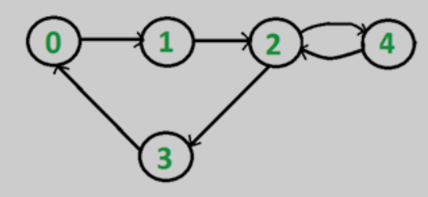
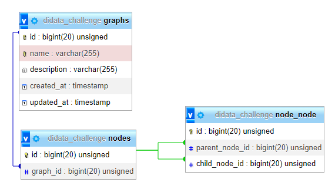

# Didata Coding Challenge

Digraphs in Laravel/Eloquent



## DB



## Setup

```shell
git clone https://github.com/medilies/didata_coding_challenge
```

```shell
cd didata_coding_challenge
```

```shell
composer install
```

```shell
 cp .\.env.example .\.env
```

- create a database and fill its credentials in `.env`

```shell
php artisan key:generate
```

## Commands

Create a random graph with nodes and random relations

```shell
php artisan graph:gen --nbNodes=<int>
```

Display a graph stats

```shell
php artisan graph:stats --gid=<int>
```

Delete all empty graphs

```shell
php artisan graph:clear
```

## Testing

```shell
php artisan test
```

```shell
php artisan migrate:fresh --seed
```
